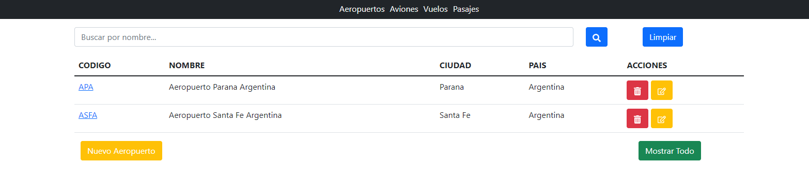

# Flights App

This is a group project made for the "Lab IV" course at UTN-FRP. 

## Description

The task was to make a web application using a REST API to perform simple CRUD operations for different entities using the technologies learned during the four-month period: Bootstrap, React, Axios, FastAPI, SQLAlchemy, Uvicorn and finally PostgreSQL for our DB.
